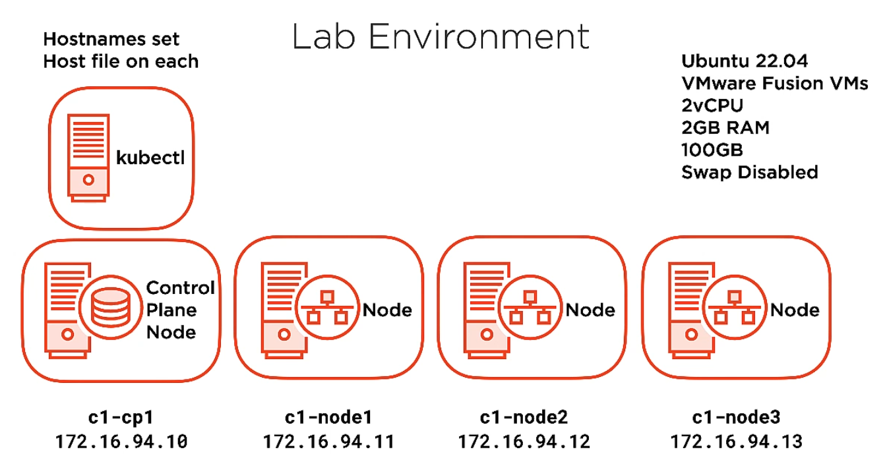
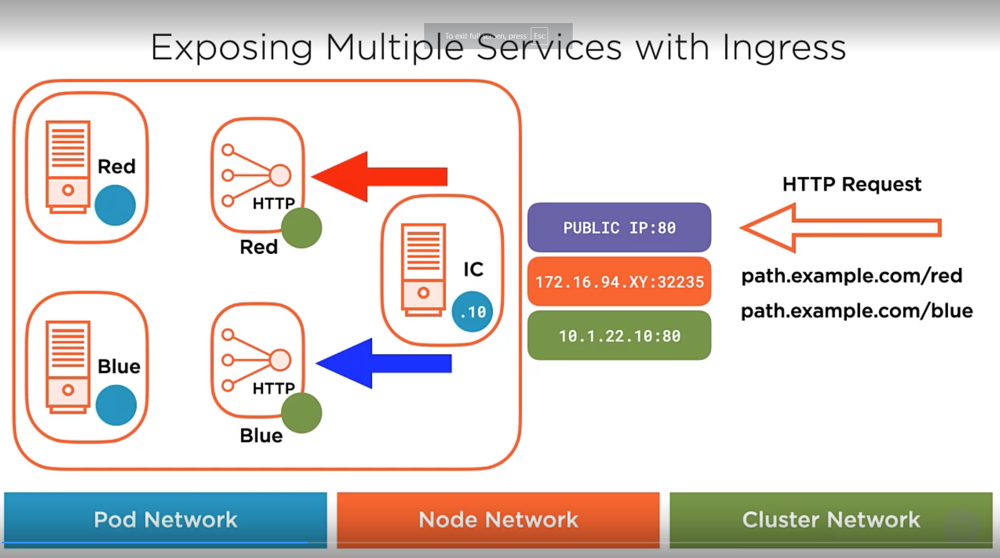
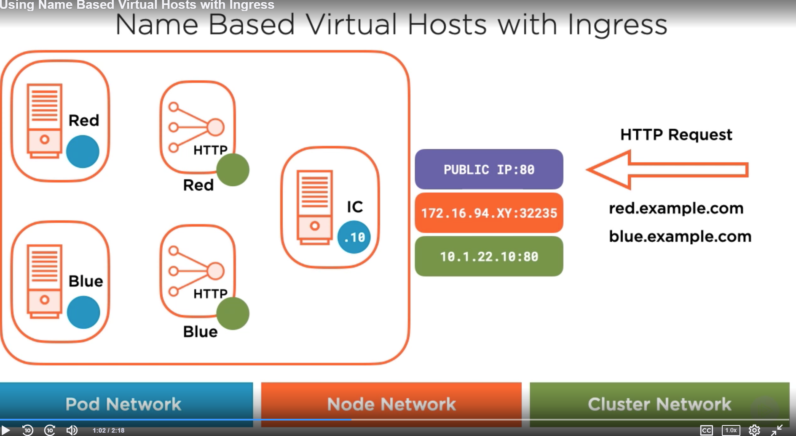
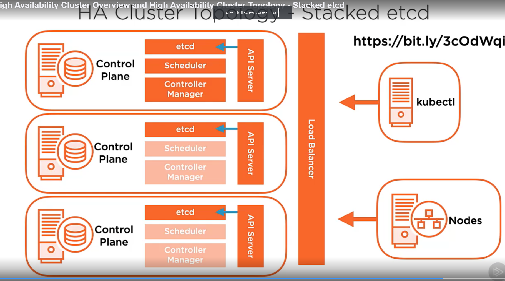
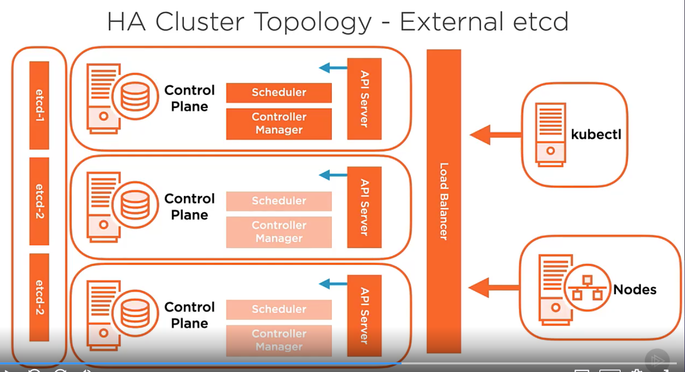
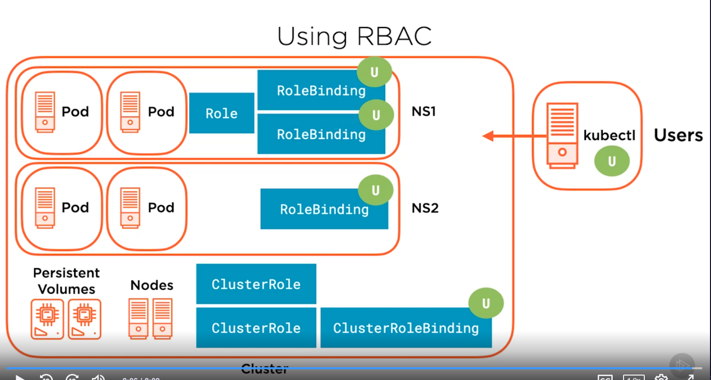

# Automation
<pre>
ansible-playbook automated_install.yml -i localhost,
</pre>

# ansible-kubernetes

# Run with ansible-playbook automated_install.yml -i localhost,

Notes:
- Research Next:
    - Course:  Managing Ingress Traffic Patterns for Kubernetes Services
- Add to Kubernetes Build Process:
- sudo apt-get install -y bash-completion
- echo "source <(kubectl completion bash)" >> ~/.bashrc
- source ~/.bashrc

## Kubernetes Installation

### Installation Requirements
- Linux-Ubuntu/RHEL
- 2 CPU
- 2GB RAM
- Swap disabled
- Container runtime (containerd)

Ports:
<pre>
Control Plane Node:
Component               Ports(tcp)      Used By
   API                  6443            ALL
   etcd                 2379-2380       API/etcd
   Scheduler            10251           Self
   Controller Manager   10252           Self
   kubelet              10250           Control Plane

Worker Node:
Component               Ports(tcp)      Used By
   kubelet              10250           Control Plane
   NodePort             30000-32767     ALL   
</pre>

Required Packages:
- containerd
- kubelet
- kubeadm
- kubectl
INSTALL ON ALL NODES IN CLUSTER!

## Lab Setup

PS C:\Program Files\Oracle\VirtualBox> .\VBoxManage.exe modifyvm development --natnet1 "172.16/16"
PS C:\Program Files\Oracle\VirtualBox> .\VBoxManage.exe modifyvm c1-cp1 --natnet1 "172.16/16"

Add svc acct public key to authorized_keys on all nodes
Generate ssh keys on c1-cp1 and distribute to all worker nodes
Add IP address to /etc/hostnames on all nodes
<pre>
development=172.16.0.15/16
c1-cp1=172.16.0.4/16
ssh-copy-id -i id_rsa.pub srussel0@172.16.0.4
</pre>

Add entries to /etc/hosts for all nodes

- Disable swap
  - swapoff -a
  - modify /etc/fstab
    - comment out the /swap.img ... line
    - reboot

Install packages (follow):
- [0-PackageInstallation-containerd.sh](course/content/installing-kubernetes/03/demos/0-PackageInstallation-containerd.sh)
- [1-CreateControlPlaneNode-containerd.sh](course/content/installing-kubernetes/03/demos/1-CreateControlPlaneNode-containerd.sh)

## kubeadm
kubeadm creates kubeconfig files in /etc/kubernetes that define how to connect to your cluster
- admin.conf (kubernetes-admin)
- kubelet.conf
- controller-manager.conf
- scheduler.conf

It also is used to create static pod manifests (configurations) in /etc/kubernetes/manifests
- etcd
- API Server
- Controller Manager
- Scheduler

## Overlay networking (Software Defined Networking)
- Uses tunneling and encapsulating packets to present one layer 3 network
- Flavors include:
  - Flannel - Layer 3 virtual network
  - Calico - L3 and policy based traffic management
  - Weave Net - multi-host network

## Kubectl
- apply/create - create resource(s)
- run - start a pod from an image
- explain - documentation of resources
- delete - delete a resource
- get - list resources
- describe - detailed resource information
- exec - execute a command on a container
- logs - view logs on a container

Pod CIDR - kubectl get nodes -o jsonpath='{.items[*].spec.podCIDR}'

[https://kubernetes.io/docs/reference/kubectl/overview/#operations](https://kubernetes.io/docs/reference/kubectl/overview/#operations)

### Resources
nodes (no)
pods (po)
services (svc)

[https://kubernetes.io/docs/reference/kubectl/overview/#resource-types](https://kubernetes.io/docs/reference/kubectl/overview/#resource-types)

### Output
- wide - output additional info
- yaml - YAML formatted API object
- json - JSON formatted API object
- dry-run - print an object without sending it to the API Server.
It just outputs the YAML for the object

[https://kubernetes.io/docs/reference/kubectl/kubectl/](https://kubernetes.io/docs/reference/kubectl/kubectl)

[https://kubernetes.io/docs/reference/kubectl/cheatsheet/](https://kubernetes.io/docs/reference/kubectl/cheatsheet)

### Bash autocompletion with kubectl
<pre>
sudo apt-get install -y bash-completion
echo "source <(kubectl completion bash)" >> ~/.bashrc
source ~/.bashrc
kubectl g[tab][tab] po[tab][tab] --all[tab][tab]
</pre>

## Application Deployment in Kubernetes
<pre>
apiVersion: apps/v1
kind: Deployment
metadata:
  name: hello-world
spec:
   replicas: 1
   selector:
      matchLabels:
         app: hello-world
   template:
      metadata:
         labels:
            app: hello-world
      spec:
         containers:
         - image: gcr.io/google-samples/hello-app:1.0
           name: hello-app
</pre>

<pre>kubectl apply -f deployment.yaml</pre>

### Using dry-run to generate package manifests yaml files

<pre>
kubectl create deployment hello-world --image=gcr.io/google.-samples/hello-app:1.0 --dry-run=client -o yaml > deployment.yaml
</pre>

### View and access containers running on a worker node
<pre>
# ssh to the worker node
sudo crictl --runtime-endpoint unix:///run/containerd/containerd.sock ps

kubectl exec -it  hello-world-pod -- /bin/sh
</pre>

## Using the Kubernetes API

[https://kubernetes.io/docs/reference/kubernetes-api/](https://kubernetes.io/docs/reference/kubernetes-api/)

- Running --dry-run=client does not post it to the API, just prints the object to stdout
- Running --dry-run=server does post it to the API, but DOES NOT persist in storage in /etcd

### kubectl diff
- Generate the differences between resources running in the cluster and resources defined in a manifest or stdin
<pre>kubectl diff -f newdeployment.yaml</pre>

### API Groups
- Core API (Legacy Group)
   - Pod
   - Node
   - Namespace
   - PersisentVolume
   - PersistenVolumeClaim
- Named API Groups
   - Part of the API Object's URL in API Requests
   - apps
       - Deployment object
   - storage.k8s.io
       - StorageClass
   - rbac.authorization.k8s.io
       - Role

### API Paths
- Core API (Legacy)
    - http://apiserver:port/api/$VERSION/$RESOURCE_TYPE
    - http://apiserver:port/api/$VERSION/namespaces/$NAMESPACE/$RESOURCE_TYPE/$RESOURCE_NAME
- API Groups
    - http://apiserver:port/apis/$GROUPNAME/$VERSION/$RESOURCE_TYPE

### Using kubectl proxy and curl to authenticate to the API server and make a request
uses local kubeconfig to authenticate
<pre>
kubectl proxy &
[1] 304260
$ Starting to serve on 127.0.0.1:8001
curl http://localhost:8001/api/v1/namespaces/default/pods/hello-world | head -n 10

$ fg
kubectl proxy
^C
</pre>

### Streaming changes to a resource in real-time with watch
<pre>
$ kubectl get pods --watch -v 6 &
$ netstat -plant | grep kubectl
tcp        0      0 10.92.63.241:49456      10.92.63.241:6443       ESTABLISHED 306301/kubectl
$ kubectl delete pods hello-world
pod "hello-world" deleted
hello-world   1/1     Terminating   0          15m
hello-world   1/1     Terminating   0          15m
hello-world   0/1     Terminating   0          15m
hello-world   0/1     Terminating   0          15m
hello-world   0/1     Terminating   0          15m
hello-world   0/1     Terminating   0          15m
</pre>

## Organizing objects with namespaces
- namespaces - ability to subdivide a cluster and it's resources
    - Basically a "virtual cluster"
    - default, kube-public, kube-system
    - User Defined
<pre>
apiVersion: v1
kind: Namespace
metadata:
  name: mynamespace
</pre>
To declare an app in a namespace
<pre>
apiVersion: apps/v1
kind: Deployment
metadata:
  namespace: mynamespace
</pre>

> kubectl get all --all-namespaces    # Great for troubleshooting!

## Organizing objects with labels & querying with selector
- Non-hierarchical, key/value pair
  - keys can be 63 characters or less
  - values can be 253 characters or less
<pre>
apiVersion: v1
kind: Pod
metadata:
   name: nginx-pod
   labels:
     app: v1
     tier: PROD
spec:
    ...
</pre>
<pre>
kubectl label pod nginx tier=PROD app=v1
kubectl label pod nginx tier=DEBUG app=v1 --overwrite
</pre>
Removing a label
<pre>kubectl label pod nginx app-</pre>
Show labels
<pre>kubectl get pods --show-labels</pre>
Query using a selector
<pre>
kubectl get pods --selector tier=prod
kubectl get pods -l 'tier [notin|in] (prod,qa)'
</pre>

## Using lables and annotations
> ReplicaSet can be equivalent to version of a app/deployment
<pre>
kind: Deployment
...
spec:
  selector:
    matchLabels:
      run: hello-world
...
    template:
      metadata:
        labels:
          run: hello-world
</pre>
Syntax for a service to run a label
<pre>
kind: Service
...
spec:
  selector:
    run: hello-world
</pre>
<pre>
kubectl get pods --show-labels
</pre>
<b>Remember -l 'label=value'  or -l 'label in (value1, value2)' when using selector</b>

show pods and associated APP
<pre>kubectl get pods -L tier,app</pre>

### Useful technique for debugging a pod
- Relabel the pod's pod template hash to remove it from the replica set
<pre>
kubectl label pod PASTE_POD_NAME_HERE pod-template-hash=DEBUG --overwrite
</pre>
- The container registry will automatically spin up a pod to replace it
- Now you can debug the pod while having a full replic set

### Annotations
- Used to add additional info about your cluster resources
- Mostly used by people or tooling to make decisions
- Build, release, and image information exposed in earsily accessible areas
- Saves you from having to write integrations to retrieve data from external data sources
- non-hierarchical, key/value pair
- Can't be used to query/select Pods or other resources
<pre>
apiVersion: v1
kind: Pod
metadata:
  name: nginx-pod
  annotation: owner: Steve
spec:
  containers:
  - name: nginx
    image: nginx
...

$ kubectl annotate pod nginx-pod owner=Steve
</pre>

## Running and Managing Pods
### Static Pods
- Managed by the kubelet on nodes
- Static Pod manifests
- staticPodPath in kubelet's configuration
    - Create the manifest in the /etc/kubernetes/manifests directory on a worker node
- staticPodPath can be modified by editing the /var/lib/kubelet/config.yaml file
- staticPodPath is watched
- can't be controlled by the API server

Getting a shell on a specific container
<pre>kubectl exec -it POD1 --container CONTAINER1 -- /bin/bash</pre>

To get access to a container based application
<pre>kubectl port-forward pod POD1 LOCALPORT:CONTAINERPORT &</pre>

### Multi-container Pods
- Tightly coupled applications
- Scheduling processes together
- Containers can share resources within that pod
    - Usually one container generating data and another one consuming it
<pre>
apiVersion: v1
kind: Pod
metadata:
  name: multicontainer-pod
spec:
  containers:
  - name: nginx
    image: nginx
    ports:
    - containerPort: 80
  ...
  - name: alpine
    image: alpine
  ...
</pre>
- Don't combine a Web Server container and a Database server container in the same pod
- Containers within a pod communicate to each other via the loopback interface
- Two containers within a pod cannot both have the same network port exposed
- Volumes are defined at the pod level
    - Shared resource within the pod
    - Common way for containers to exchange data

### Init Containers
- Runs before main application container
- Contains utilities or setup for apps
- Run to completion
- Can have more than one init container per pod
- They are ran sequentially
- If an init container fails, the container restartPolicy applies

When to use Init Containers
- To run tools or utilies to setup the main execution environment
- Separation of duties
    - The init container could be run at a higher privilege level than the execution environment
- Block Container Startup
    - Sets environment variables before the main execution environment starts
<pre>
apiVersion: v1
kind: Pod
...
spec
  initContainers:
  - name: init-service
    image: ubuntu
    command: ['sh', '-c', "echo waiting for service; sleep 2"]
  - name: init-database
    image: ubuntu
    command: ['sh', '-c', "echo waiting for database; sleep 2"]
  containers:
  - name: app-container
    image: nginx
</pre>

## Pod Lifecycle
### Terminating Pods
1. Grace Period Timer (30 sec default)
2. Pod state changes to terminating
3. Controller sends SIGTERM signal to shutdown apps gracefully
4. Service endpoints and controllers are updated
5. IF > Grace Period, controller sends a SIGKILL to all running processes
6. API and etcd are updated

<pre>kubectl delete pod <name> --grace-period=<seconds></pre>

To force deletion use
<pre>--grace-period=0 --force</pre>

<pre>
apiVersion: v1
kind: Pod
metadata:
  name: nginx-pod
spec:
  containers:
  - name: nginx
    image: nginx
  restartPolicy: OnFailure
...
</pre>

### Persistency of Pods
- A pod is never redeployed
- If a pod stops a new one is created
- Configuration of a pod is managed externally
- Passing environment variables into containers is done often
- Data persistency is also managed externally using volumes
    - PersistentVolume
    - PersistentVolumeClaim

### Container Restart Policy
- A container in a pod can restart independent of the pod
- Restarts with an exponential backoff, 10s, 20s, 40s, capped at 5m and reset to 0 after 10m of successful runtime
- Policies
    - Always (default)
    - OnFailure - Non-graceful termination
    - Never

<pre>
apiVersion: v1
kind: Pod
metadata:
  name: hello-world-pod
spec:
</pre>

### Defining Pod Health
- A pod is considered Ready when all containers are Ready
- Container Probes can add more visibility into container health
    - livenessProbe
        - Runs a diagnostic check on a container
        - Per container setting
        - On failure restarts the container
    - readinessProbe
        - Runs a diagnostic check on a container
        - Per container setting
        - On failure the entire Pod is removed from load balancing
        - Used to protect applications that temporarily can't respond to a request
        - Prevents users from seeing errors
    - startupProbe
        - Runs a check to ensure all containers in a Pod are Ready
        - Per container setting
        - On startup, all other probes are disabled until the startupProbe succeeds
        - On failure, the kubelet restarts the container according to the container restart policy
        - Useful for applications that have long startup times

Diagnostic Checks for Probes
- Exec
    - Runs a command in a container and reads the process exit code to determine if it is healthy
- tcpSocket
    - Checks to see if a TCP connection can be established to the container over a specific port
- httpGet
    - Executes a URL check agains a URL on the container and gets the Return Code
        - If response code >= 200 and < 400 the check is successful

Configuring Container Probes
- initialDelaySeconds - Number of seconds after the container has started before running container probes, default 0
- periodSeconds - probe interval, default 10 sec
- timeoutSeconds - Probe timeout 1 seconds
- failureThreshold - Number of missed checks before reporting failure, default 3
- successThreshold - Number of probes to the considered successful and live, default 1

<pre>
spec:
  containers:
  ...
  livenessProbe:
    tcpSocket:
      port: 8080
    initialDelaySeconds: 15
    periodSeconds: 20
</pre>

Startup Probes

<pre>
spec:
  containers:
  ...
    startupProbe:
      tcpSocket:
        port: 8080
      initialDelaySeconds: 10
      periodSeconds: 5
</pre>

## Kubernet Controllers and Deployments
Writing a deployment yaml
<pre>
apiversion: apps/v1
kind: Deployment
metadata:
  name: hello-world
spec:
  replicas: 5
  selector:
    matchLabels:
      app: hello-world
  template:
    metadata:
      labels:
        app: hello-world
    spec:
      containers:
  ...
</pre>

### ReplicaSets
- Deploys a defined number of pods
- Consists of a Selector, Number of Replicas(Pods) and a Pod Template
- Generally you don't create ReplicaSets directly, they are created via Deployments

Defining a ReplicSet (usually not needed, except for troubleshooting)
<pre>
apiVersion: apps/v1
kind: ReplicaSet
...
spec:
  replicas: 1
  selector:
    matchLabels:
      app: hello-world
  template:
    metadata:
      labels:
        app: hello-world-pod
    spec:
      containers:
</pre>

ReplicaSet Selectors
- ReplicaSets allow for more complex, set based selectors
    - Can use matchLabels or matchExpressions
        - matchExpressions allows operators: In, NotIn, Exists, and DoesNotExist
<pre>
apiVersion: apps/v1
kind: ReplicaSet
...
spec:
  replicas: 1
  selector:
    matchExpressions:
      - key: app
        operator: In
        values:
          - hello-world-pod-me
  template:
    metadata:
      labels:
        app: hello-world-pod-me
    spec:
      containers:
  ...
</pre>

ReplicaSet Failures
- Transient Failure
- Permanent Failure
- Setting on the controller that controls how long unaccessable pods are active
    - pod-eviction-timeout (5mins default)

## Deploying application updates
- Using deployments to roll out a new version of the container image
    - Deployment controls the container deletion/deployment of app for new image version
    - Triggered by changing the pod template

Updating a deployment object
<pre>kubectl set image deployment hello-world hello-world=hello-app:2.0 --record</pre>

--record records information about the change and records it in annotations (very important for rollbacks)

<pre>kubectl edit deployment hello-world</pre>

Opens yaml representation in a text editor to edit

Using declarative code

<pre>kubectl apply -f hello-world-deployment.yaml --record</pre>

### Checking deployment status
<pre>kubectl rollout status deployment [name]</pre>

### Controlling pods rollout
- RollingUpdate(default)
    - A new ReplicaSet starts scaling up and the old ReplicaSet starts scaling down
- Recreate
    - Terminates all pods in the current ReplicaSet prior to scaling up the new ReplicaSet
        - Used when the new app is not supported alongside the old app

Controlling the rate of rollout
- maxUnavailable
    - Ensures only a certain number of pods are unavailable being updated (default 25%)
- maxSurge
    - Ensures that only a certain number of pods are created above the desired number of pods

<pre>
apiVersion: apps/v1
kind: Deployment
...
spec:
  replicas: 20
  strategy:
    type: RollingUpdate:
    rollingUpdate:
      maxUnavailable: 20%
      maxSurge: 5
...
template:
...
    spec:
      containers:
...
        readinessProbe:
          httpGet:
            path: /index.html
            port: 8080
          initialDelaySeconds: 10
          periodSeconds: 10
</pre>

### Pausing and Rolling Back Deployments
Pausing a rollout
- Changes to the Deployment while paused are not rolled out
- Batch changes together, then resume the rollout
- The current state of the Deployment is maintained until it's resumed
<pre>
kubectl rollout pause deployment my-deployment
kubectl rollout resume my-deployment
</pre>
Rolling back a deployment
- The deployment controller will track:
    - Rollout history
        - CHANGE-CAUSE Annotation Deployment
    - Revision History
        - revisionHistoryLimit defaults to 10
            - Can be set to 0 for immediate cleanup
<pre>
kubectl rollout history deployment hello-world
kubectl rollout history deployment hello-world --revision=1
# Rollback to previous version
kubectl rollout undo deployment hello-world
kubectl rollout undo deployment hello-world --to-revision=1
</pre>

Restarting a deployment
<pre>kubectl rollout restart deployment hello-world</pre>

### Scaling Deployments
<pre>kubectl scale deployment hello-world --replicas=10</pre>
- Horizontal Pod Autoscaler
    - Scales by resource availability

## Deploying and Maintaining Applications with DaemonSets and Jobs
- DaemonSet : When you need to run a single pod on every node or subset of nodes in the cluster
    - Effectively an init daemon inside your cluster
    - Example workloads:
        - kube-proxy for network services
        - Log collectors
        - Metric servers
        - Resource monitoring agents
        - Storage daemons
    - One pod will be scheduled to each worker node in a cluster by the default-scheduler
    - As nodes join the cluster they will get a pod
    - Use a Node Selector to control which nodes get a pod
<pre>
apiVersion: apps/v1
kind: DaemonSet
metadata:
  name: hellow-world-ds
spec:
  selector:
    matchLabels
      app: hello-world-app
  template:
    metadata:
      labels:
        app: hello-world-app
    spec:
      containers:
        - name: hello-world
          image: gcr.io/google-samples/hello-app:1.0
</pre>
To define a daemonset with a node selector
<pre>
apiVersion: apps/v1
kind: DaemonSet
metadata:
  name: hellow-world-ds
spec:
  selector:
    matchLabels
      app: hello-world-app
  template:
    metadata:
      labels:
        app: hello-world-app
    spec:
      nodeSelector:
        node: hello-world-ns
...
</pre>
- Updating Daemonsets
    - Rolling Update
    - OnDelete
        - New pods are created only when you manually delete old pods
- Jobs
    - Creates one or more pods
    - Run a program in a container until completion
    - Ensure that the specified number of pods completes successfully
        - Based on Return Code
    - Workload Examples:
        - Ad-hoc
        - Batch
        - Data oriented tasks
    - Responsibility of the Job Controller to ensure pods run to completion
        - Interrupted Execution
            - If a node fails the job controller reschedules pod
        - Non-zero Exit Code
            - Action depends on the restartPolicy
                - OnFailure
                - Never
    - On completeion the job object remains, pods are NOT deleted
<pre>
apiVersion: batch/v1
kind: Job
metadata:
  name: hello-world
spec:
  template:
    spec:
      containers:
      - name: ubuntu
        image: ubuntu
        command:
           - "/bin/bash"
           - "-c"
           - "/bin/echo Hello from Pod $(hostname) at $(date)"
      restartPolicy: Never
</pre>

### Controlling Job Execution
- backoffLimit - number of retrues before it's marked failed (default: 6)
- activeDeadlineSeconds - max execution time for the job
- parallelism - max number of running pods in job at a point in time
- completions - number of pods that need to finish successfully

Cronjobs
- CronJobs
    - Example Workloads
        - Period workloads and scheduled tasks
    - When it's time, a Job is created via the Job template from the CronJob object
    - Controlling CronJobs Execution
        - suspend
        - startingDeadlineSeconds - if job hasn't started in x sec it failed
        - concurrencyPolicy
            - Allow
            - Forbid
            - Replace
<pre>
apiVersion: batch/v1
kind: CronJob
metadata:
  name: hello-world-cron
spec:
  schedule: "*/1 * * * *"
  jobTemplate:
    spec:
      template:
        spec:
          containers:
          - name: ubuntu
    ...
</pre>
- StatefulSets : Provides the needed architecture for stateful solutions.  Manages persistent storage
    - Enables stateful applications to be managed by a controller
    - Example Workloads:
        - Database workloads
        - Caching servers
        - Application state for web farms
    - Persistent Naming
        - Naming has to be unique
    - Persistent Storage
    - Headless Service
        - Services that don't have load balancers or cluster IPs and give our cluster applications the ability to use Cluster DNS to locate each other by name

## Configuring and Managing Kubernetes Storage & Scheduling
### Persistent Storage & Containers
- Persistant State API Objects:
    - Volume
    - PersistentVolume
        - Volume avilable to pods
    - PersistentVolumeClaim
        - Request for a PersistentVolume
        - Responsibility of PersistentVolume to validate claim
    - StorageClass
        - Offer groups or classes of storage available

### Volumes
- Persistent storage deployed as part of of the pod spec
- Implementation details for your storage

Persistent Volume
- An API type that defines the storage in the cluster
- Lifecycle independent of the pod

[https://kubernetes.io/docs/concepts/storage/persistent-volumes/](https://kubernetes.io/docs/concepts/storage/persistent-volumes/)

Types of Persistent Volumes
- Networked
    - NFS
    - azureFile
- Block
    - Fibre Channel
    - iSCSI
- Cloud
    - awsElasticBlockStore
    - azureDisk
    - gcePersistentDisk

Persistent Volume Claims
- A volume type in our pod spec
- In our pod we declare a volume type pointing to the API object (PersistentVolumeClaim)
- The PVC makes a request for the volume required and then exposes the PV as a mount inside the container
    - Size
    - Access Mode
    - Storage Class
- Access Mode - Controls how nodes access a PV
    - ReadWriteOnce(RWO)
        - One node can mount a volume for RW access
    - ReadWriteMany(RWX)
        - More than one node can mount a volume for RW access
    - ReadOnlyMany(ROX)
        - More than one node can mount a volume for RO access
    - These are node level access not pod level access

Storage Lifecycle
- Binding
- Using
- Reclaim

<pre>
apiVersion: v1
kind: PersistentVolume
metadata:
  name: pv-nfs-data
spec:
  capacity:
    storage: 10Gi
  accessModes:
    - ReadWriteMany
  nfs:
    server: 172.16.9.5
    path: "/export/volumes/pod"
</pre>

<pre>
apiVersion: v1
kind: PersistentVolumeClaim
metadata:
  name: pvc-nfs-data
spec:
  accessModes:
    - ReadWriteMany
  resources:
    requests:
      storage: 10Gi
</pre>

Using Persistent Volumes in Pods
<pre>
...
spec
  volumes:
    - name: webcontent
      persistentVolumeClaim:
        claimName: pvc-nfs-data
  containers:
  - name: nginx
...
    volumeMounts:
    - name: webcontent
      mountPath: "/usr/share/nginx/html/web-app"
</pre>

### Storage Class
- Define tiers/classes of storage
- Enables Dynamic Provisioning
- Define infrastructure specific parameters
- Reclaim Policy

### Dynamic Provisioning Workflow
1. Create a StorageClass
2. Create a PersistentVolumeClaim pointing to the storage class
3. Define Volume in a Pod Spec
4. Create a Persistent Volume

<pre>
apiVersion: storage.k8s.io/v1
kind: StorageClass
metadata:
  name: managed-premium
parameters:
  kind: Managed
  storageaccounttype: Premium_LRS
provisioner: kubernetes.io/azure-disk
</pre>

<pre>
apiVersion: v1
kind: PersistentVolumeClaim
metadata:
  name: pvc-azure-managed
spec:
  accessModes:
  - ReadWriteOnce
  storageClassName: managed-premium
  resources:
    requests:
      storage: 10Gi
</pre>

## Environment Variables, Secrets, and ConfigMaps

### Configuring Applications in Pods
- Command Line Arguments
- Environment Variables
    - User defined
        - Pod Spec for each container
        - Defined in name/value or valueFrom
    - System defined
        - Names of all Services available at the time the Pod was created
    - Defined at Container startup
    - Can't be updated once the Pod is created
<pre>
spec:
  containers:
  - name: hello-world
    image: image-name
    env:
    - name: DATABASE_SERVERNAME
      value: "sql.example.local"
    - name: BACKEND_SERVERNAME
      value: "be.example.local"
</pre>
- Config Maps

### Secrets
- base64 encoded
- Encryption can be configured
- Stored in etcd
- Namespaced and can only be referenced by Pods in the same Namespace

[https://kubernetes.io/docs/tasks/administer-cluster/encrypt-data/](https://kubernetes.io/docs/tasks/administer-cluster/encrypt-data/)

- 3 Types of Secrets
    - Docker Registry
    - Generic
    - TLS

<pre>kubectl create secret generic app1 --from-literal=USERNAME=app1login --from-literal-password=PASSWORD='password'</pre>

Using Secrets in Pods
- Read secret into Environment Variable
- Volumes or Files
    - Updatable without having to recreate pod
- Secret can be marked immutable

<pre>
spec:
  containers:
  - name: hello-world
  ...
    env:
    - name: app1username
      valueFrom:
        secretKeyRef:
          name: app1
          key: USERNAME
    - name: app1password
      valueFrom:
        secretKeyRef:
          name: app1
          key: PASSWORD
</pre>

Can be rewritten as
<pre>
spec:
  containers:
  - name: hello-world
  ...
    envFrom:
    - secretRef: app1
</pre>

Using Secrets as files
<pre>
spec:
  volumes:
    - name: appconfig
      secret:
        secretName: app1
  containers:
  ...
    volumeMounts:
      - name: appconfig
        mountPath: "/etc/appconfig"
</pre>

This will create an /etc/appconfig/USERNAME and /etc/appconfig/PASSWORD file

Accessing a Private Container Registry
- Secrets for application configuration
- Use Secrets to access a private container registry
- To access registries over the Internet
    - Create a secret of type docker-registry
    - This enables the kubelet to pull the images from the private registry

### ConfigMaps
- Kubernetes API object that uses key value pairs exposed into a Pod used to make application configuration changes
- Define application or environment specific settings
- Can be exposed as Environment Variables or Files

Using Environment Variables to Expose ConfigMap to Pod
- Volume ConfigMaps CAN be updated
- Can be marked immutable
<pre>
apiVersion: v1
kind: ConfigMap
metadata:
  name: appconfigprod
data:
  BACKEND_SERVERNAME: be.example.local
  DATABASE_SERVERNAME: sql.example.local
</pre>

Using ConfigMaps in Environment Variables
<pre>
spec:
  containers:
  - name: hello-world
  ...
    env:
    - name: DATABASE_SERVERNAME
      valueFrom:
        configMapKeyRef:
          name: appconfigprod
          key: DATABASE_SERVERNAME
    - name: BACKEND_SERVERNAME
      valueFrom:
        configMapKeyRef:
          name: appconfigprod
          key: BACKEND_SERVERNAME
</pre>

Shortened using envFrom
<pre>
containers
- name: hello-world
...
envFrom:
  - configMapRef:
      name: appconfigprod
</pre>

Using ConfigMaps as Files
<pre>
spec:
  volumes:
    - name: appconfig
      configMap:
        name: appconfigqa
  containers:
  - name: hello-world
  ...
    volumeMounts:
      - name: appconfig
        mountPath: "/etc/appconfig"
</pre>

## Managing and Controlling the Kubernetes Scheduler

- Selecting a Node to start a Pod on

Scheduling Process
- Scheduler watches the API server for unscheduled pods
- Node selection
- Update nodeName in the pod object
- Nodes' kubelets watch API Server for work
- Signal container runtime to start container(s)

Node Selection
- Filtering
- Scoring
- Binding

Resource Requests
- Setting requests will cause the scheduler to find a Node to fit the workload/pod
- requests are guarantees
    - CPU
    - Memory
- If there are not enough resources in the cluster the pod goes Pending

### Controlling Scheduling
- Node Selector
- Affinity
- Taint and Tolerations
- Node Cordoning
- Manual Scheduling

Node Selector
- Applying labels to nodes
- Scheduling assigns pods to a node with a matching label

<pre>kubectl label node c1-node3 hardware=local_gpu</pre>

<pre>
spec:
  containers:
  - name: hello-world
    image: gcr.io/google-samples/hello-app:1.0
    ports:
    - containerPort: 8080
  nodeSelector:
    hardware: local_gpu
</pre>

Node Affinity
- Uses Labels on Nodes to make a scheduling decision with matchExpressions
    - requiredDuringSchedulingIgnoredDuringExecution
        - A pod will not be scheduled here unless the rules defined here evaluate to True
    - preferredDuringSchedulingIgnoredDuringExecution
        - A pod will still be scheduled if the rules evaluate to NOT True

Pod Affinity
- Schedule Pods onto the same Node or Zone
    - Can use matchLabels and matchExpressions
- podAntiAffinity - Ensure Pods are distributed among Nodes

Code to ensure a caching server pod is always scheduled alongside a web server pod
<pre>
spec:
  containers
  - name: hello-world-cache
  ...
  affinity:
    podAffinity:
      requiredDuringSchedulingIgnoredDuringExecution:
      - labelSelector:
        matchExpressions:
        - key: app
          operator: In
          values
          - hello-world-web
        topologyKey: "kubernetes.io/hostname"
</pre>

### Taints and Tolerations
- Taints: Avoid scheduling a pod on a particular node
- Tolerations: Allow a pod to ignore a Taint and be scheduled as normal
- Useful when the cluster administrator needs to ifluence scheduling without depending on the user
- key=value:effect

<pre>kubectl taint nodes c1-node1 key=MyTaint:NoSchedule</pre>

Effects:
- NoSchedule
- PreferNoSchedule
- NoExecute

<pre>
spec:
  containers:
  - name: hello-world
    image: gcr.io/google-samples/hello-app:1.0
    ports:
    - containerPort: 8080
  tolerations:
  - key: "key"
    operator: "Equal"
    value: "MyTaint"
    effect: "NoSchedule"
</pre>

### Node Cordoning
- Marks a Node as unschedulable
- Prevents new Pods from being scheduled to that Node
- Does not affect any existing Pods on the Node
- This is useful as a preparatory step before a Node reboot or maintenance

<pre>
kubectl cordon c1-node3
kubectl drain c1-node3 --ignore-daemonsets
</pre>

## Configuring & Managing Kubernetes Networking, Services, and Ingress
### Networking Model
- All Pods can communicate with each other on all Nodes
- Agents on a Node can communicate with all Pods on that Node
- No Network Address Translation (NAT)

### Networking Topology
Cluster NetworkingTopology
- Node Network defined by the Administrator
- Default Pod CIDR Range 192.168.0.0/16
- Cluster Network is used by Services

Pod Networking Topology
- Pod to Pod within a host is over localhost
- Pod to Pod on another node will use real IP address of Pod

When a Container Starts
- A 'Pause/Infrastructure' container is created
    - Starts the networking namespace
    - If the application container restarts the network will persist

Container Network Interface - CNI
[https://kubernetes.io/docs/concepts/cluster-administration/networking/](https://kubernetes.io/docs/concepts/cluster-administration/networking/)

### Cluster DNS
- DNS is available as a Service in a Cluster
    - CoreDNS
- DNS records that get created:
    - Services - A/AAAA records
    - Namespaces - subdomains

Configuring a Forwarder
<pre>
apiVersion: v1
king: ConfigMap
metadata:
  name: coredns
  namespace: kube-system
data:
  Corefile: |
    .:53 {
      ...
      kubernetes cluster.local in-addr.arpa ip6.arpa {
        pods insecure
        fallthrough in-addr.arpa ip6.arpa
        ttl 30
      }
      forward . 1.1.1.1         # Could also be forward . /etc/resolv.conf to use what is defined in /etc/resolv.conf
    }
</pre>
[https://coredns.io/manual/toc/](https://coredns.io/manual/toc/)

Configuring Pod DNS
- ClusterFirst (default)
- None : Define in Container Spec
- Default : Inherit from Node
<pre>
...
    spec:
      containers:
      - name: hello-world
        image: imagename
        ports:
          - containerPort: 8080
      dnsPolicy: "None"
      dnsConfig:
        nameservers:
          - 9.9.9.9
        searches:
          - db1.ns1.svc.cluster.local
</pre>

## Services
- Persistent access endpoints for clients
- Adds persistency to the ephemerality of Pods
- Networking abstraction providing persisten virtual IP and DNS
- Load balances to the backend Pods
- Automatically updated during Pod controller operations
- Uses labels and selectors
- Controller creates and registers Endpoints in the Service (Pod IP and Port pair)
- Implemented in the kube-proxy on the Node in iptables

### Service Types
- ClusterIP (default)
    - Exposes the service at a internal cluster IP that only exists in iptables
    - Provides access to services within a cluster
- NodePort
    - Backended by a Cluster IPs service
        - Uses a NodePort Port mapped to a cluster IP port
    - Will use the Node's IP address and map that to an address in the Cluster IP service
        - Commonly used when you need to integate with external load balancers
            - Typical with desktop development scenarios where you have no external load balancer
- LoadBalancer   ** stupid, see later **
    - Pod Service interacts with a cloud load balancer
    - Also includes NodePort in that it assigns the Node Network to the pods

Using the run label to select a Service
<pre>
kind: Deployment
...
  template:
    metadata:
      labels:
        run: hello-world
    spec:
        containers:
</pre>

<pre>
kind: Service
...
spec:
  type: ClusterIP
  selector:
    run: hello-world
</pre>

<pre>kubectl create deployment hello-world --image=imagename</pre>
<pre>kubectl expose deployment hello-world --port=80 --target-port=8080 --type NodePort</pre>

Service Discovery
- Uses DNS and Environment Variables
- 'Normal' services get A/AAAA records
    - <svcname>.<namespace>.svc.<clusterdomain>

Other Types of Services
- ExternalName
    - Service discovery for external services
        - You define a DNS name for a service outside your cluster
        - Kubernetes will create a CNAME pointing to that external service
- Headless
    - No ClusterIP defined
    - You need a DNS record for each endpoint pointed to by the selector
    - Useful for databases and Stateful applications
- Without Selectors
    - Map services to specific endpoints
    - You need to manually create the endpoint objects
    - Point to any IP inside or outside cluster

## Configuring and managing application access with Ingress
Ingress Architecture
- Ingress Resource
- Ingress Controller
- Ingress Class
    - Used to specify a Ingress resource to a specific Ingress Controller
- Provides load balancing to endpoints bypassing the Cluster IP
- Allows for Name-based virtual hosts
    - Ingress controller reads the host header and sends that request to the appropriate resource
    - Reduces the need for public IPs.  Allows handling for multiple request using one IP address
- Allows for Path-based routing
    - Based on path in the URL provide access to unique resources within the cluster
- TLS termination
    - Authentication between client's browser and Ingress Controller

Ingress Controller
- For resources external or adjacent to your cluster
- Many types of Ingress Controllers
    - They could be running as Pods in a cluster : nginx
    - They could also be hardware running external to the cluster : Citrix, F5
    - Cloud Ingress Controllers : AppGW, Google Load Balancer, AWS ALB

Why Ingress Rather Than Load Balancers?
- Ingress operates at layer 7, and can use Path-based routing, Name-based virtual hosts
- Ingress is a single resource vs Load Balancers (cloud) is one resource per instance
$$$$ SAVES MONEY ON YOUR CLOUDBILL $$$$

Exposing a Single Service With Ingress

<pre>
apiVersion: networking.k8s.io/v1
kind: Ingress
metadata:
  name: ingress-single
spec:
  ingressClassName: nginx
  defaultBackend:
    service:
      name: hello-world-service-single
      port:
          number: 80
</pre>

Exposing Multiple Services

<pre>
spec:
  ingressClassName: nginx
  rules:
    - host: path.example.com
      http:
        paths:
        - path: /red
          pathType: Prefix
          backend:
            service:
              name: hello-world-service-red
              port:
                number: 4242
        - path: /blue
          pathType: Exact
          backend:
            service:
              name: hello-world-service-blue
              port:
                number: 4343
</pre>

If neither paths are found will result in a 404 error.  To define a defaultBackend
<pre>
defaultBackend:
  service:
    name: hello-world-service-single
    port:
      number: 80
</pre>

Path Types:
- prefix
- exact
- implementationSpecific : pushes this matching to the IgressClassingResource

### Name Based Virtual Hosts with Ingress

<pre>
spec:
  IngressClassName: nginx
  rules:
  - host: red.example.com
    http:
      paths:
      - pathType: Prefix
        path: "/"
        backend:
          service:
            name: hello-world-service-red
            port:
              number: 4242
  - host: blue.example.com
    http:
      paths:
      - pathType: Prefix
        path: "/"
        backend:
          service:
            name: hello-world-service-blue
            port:
              number: 4343
</pre>

### TLS Certificates
- Certificate is stored as a Secret in the cluster
<pre>
spec:
  ingressClassName: nginx
  tls:
  - hosts:
      - tls.example.com
    secretName: tls-secret
  rules:
  - host: tls.example.com
    http:
      paths:
      - path: /
        pathType: Prefix
        backend:
          service:
            name: hello-world-service-single
            port:
              number: 80
</pre>

## Maintaining, Monitoring, and Troubleshooting Kubernetes
### Maintaining Kubernetes

Introducing etcd
- Key/value datastore
- Stateless
- Need a solid backup/restore plan for etcd
- Need high availability

Backing up etcd
- Backup with a snapshot using the etcdctl command
- Backup files should be secured and encrypted
- Secrets are not encrypted they are hashed, so ensure the backup file is encrypted
- Schedule backups as a CronJob
- By default etcd is deployed as a single container in a pod on a control plane node
    - /var/lib/etcd   :  the default data directory

Installing etcdctl
- Download from GitHub
- Exec into an etcd Pod
- Start a etcd container and run it there

<pre>
ETCDCTL_API=3
etcdctl --endpoints=https://127.0.0.1:2379 \
  --cacert=/etc/kubernetes/pki/etcd/ca.crt \
  --cert=/etc/kubernetes/pki/etcd/server.crt \
  --key=/etc/kubernetes/pki/etcd/server.key \
  snapshot save /var/lib/dat-backup.db
</pre>

Checking if the backup snapshot is valid
<pre>
ETCDCTL_API=3
etcdctl --write-out=table \
  snapshot status /var/lib/dat-backup.db
</pre>

Restoring etcd - When etcd is running as a Pod on the control plane node
- Restore backup files to another temporary location
- Move the original data in /var/lib/etcd out of the way
- Stop the etcd pod
- Move thh restored data to /var/lib/etcd
- Kubelet will restart etcd
<pre>
ETCDCTL_API=3
etcdctl snapshot restore /var/lib/dat-backup.db
mv /var/lib/etcd /var/lib/etcd.OLD
sudo crictl --runtime-endpoint unix:///run/containerd/containerd.sock ps  # output the container id
sudo crictl --runtime-endpoint unix:///run/containerd/containerd.sock stop $CONTAINER_ID
mv ./default.etcd /var/lib/etcd
</pre>

Cluster Upgrade Process
- Upgrade the control plane node(s)
- Upgrade worker nodes
- You can only upgrade one minor versions:  1.17 -> 1.18

Upgrading Control Plane Node
- Update kubeadm package using apt or yum
- Drain the control plane node of any non control plane Pods
- kubeadm upgrade plan
    - Runs some pre-flight checks
- kubeadm upgrade apply
- Uncordon the control plane node
- Update kubelet and kubectl using apt or yum
- Upgrade any additional control plane nodes
    - kubeadm upgrade node

<pre>
sudo apt-mark unhold kubeadm
sudo apt-get update
sudo apt-cache policy kubeadm
sudo apt-get install kubeadm=$TARGET_VERSION
sudo apt-mark hold kubeadm
kubectl drain c1-cp1 --ignore-daemonsets
sudo kubeadm upgrade plan
sudo kubeadm upgrade apply v$TARGET_VERSION
kubectl uncordon c1-cp1
sudo apt-mark unhold kubelet kubectl
sudo apt-get update
sudo apt-get install -y kubelet=$TARGET_VERSION kubectl=$TARGET_VERSION
sudo apt-mark hold kubelet kubectl
</pre>

Upgrading Worker Nodes
- Update kubeadm
- Drain the node
- Mark the node unshedulable
- kubadm upgrade node
- update kubelet and kubectl
- uncordon the node

<pre>
kubectl drain c1-node1 --ignore-daemonsets
sudo apt-mark unhold kubeadm
sudo apt-get update
sudo apt-get install -y kubeadm=$TARGET_VERSION
sudo apt-mark hold kubeadm
sudo kubeadm upgrade node
sudo apt-mark unhold kubelet kubectl
sudo apt-get update
sudo apt-get install -y kubelet=$TARGET_VERSION kubectl=$TARGET_VERSION
sudo apt-mark hold kubelet kubectl
kubectl uncordon c1-node1
</pre>

### Worker Node Maintenance
- OS updates and hardware upgrades
- Drain and cordon the nodes
    - kubectl drain NODE_NAME
    - kubectl cordon NODE_NAME

### High Availability Cluster Architecture
- API Server
    - Stateless so you can run multiple Pods on multiple nodes and load balance the requests
- etcd
    - Statefull
    - Cluster several etcd nodes together
- Run multiple Control Plane Nodes

Stacked etcd implementation

- Run at least 3 control plane nodes
- The API server on each node talks to it's etcd
- Run a load balancer external to the cluster accepting these API commands that route to the three control plane nodes API server
- Point kubectl and Nodes to the Load Balancer
- etcd requires two nodes online for a quorum
- Scheduler and Controller Manager run in standby nodes on nodes 2 and 3

External etcd

- Control plane nodes do not run etcd
- etcd is run external to the control plane nodes in a etcd cluster

Cluster Topologies
- [https://bit.ly/3cOdWqi](https://bit.ly/3cOdWqi)

Building an HA Cluster with kubeadm
- [https://bit.ly/37dyMOL](https://bit.ly/37dyMOL)

Building an HA etcd cluster
- [https://bit.ly/3dOrRxH](https://bit.ly/3dOrRxH)

## Logging and Monitoring
### Logging
- stdout and stderr sent to /var/log/containers
- The last two logfiles are retained for each node
- Use log aggregators for storage of logs
    - fluentd for aggregation
    - elasticsearch for storage and searching
    - kibana for visualization

Accessing log data in Pods and Containers
<pre>
kubectl logs $POD_NAME
kubectl logs $POD_NAME -c $CONTAINER_NAME
</pre>

If the API Server is unavailable, use crictl to access the containers directly
<pre>
crictl --runtime-endpoint unix:///run/containerd/containerd.sock logs $CONTAINER_ID
</pre>

If the container is unavailable use logs on the node:
<pre>
tail /var/log/containers/$CONTAINER_NAME_$CONTAINER_ID
</pre>

Access log data on worker nodes
- kubelet runs as a systemd service and all logs are stored in journald
    - journalctl kubelet.service # use this to access logdata
- kube-proxy runs as a pod
    - Generally access with kubectl logs
    - /var/log/containers on the node

Access logs on control plane nodes
- If control plane is run on pods
    - kubectl logs -n kube-system $PODNAME
    - /var/log/containers
- systemd based system logs to journald
- /var/log/kube-apiserver.log
- /var/log/kube-scheduler.log
- /var/log/kube-controller-manager.log

Events
- kubectl get events
- kubectl describe $TYPE $NAME
- Only retained for one hour
    - Log to an external log aggregator

### Accessing object data with JSONPath

List all pods but display just the name
<pre>kubectl get pods -o jsonpath='{ .items[*].metadata.name }'</pre>

Get all the container images in use by all pods in all namespaces
<pre>kubectl get pods --all-namespaces \
        -o jsonpath='{ .items[*].spec.containers[*].image }
</pre>

Sample JSON output of kubectl get pods -o json

<pre>
"items:": [
  {
    "apiVersion": "v1",
    "kind": "Pod",
    "metadata": {
      "name": "nginx"
      ...
    }
    "spec": {
      ...
      "containers": [
        {
          "image": "nginx",
        }
      ]
    }
  }
]
</pre>

jsonpath expressions:
<pre>
.items[*].metadata.name
.items[*].spec.containers[*].image
</pre>

To get all internal IP Addresses of Nodes in a cluster
<pre>
kubectl get nodes \
  -o jsonpath="{ .items[*].status.addresses[?(@.type=='InternalIP')].address }"
</pre>

Monitoring
- Premethius
- Grafana

Kubernetes Metrics Server
- Provides resources metrics Pods and Nodes
    - At a point in time
- Collects resource metrics from kubelets and exposes them to the API server
- CPU and Memory
- kubectl top pods
- kubectl top nodes
- [https://github.com/kubernetes-sigs/metrics-server](https://github.com/kubernetes-sigs/metrics-server)

### Troubleshooting Control Plane Nodes
- Controlled by static pod manifests
    - /etc/kubenetes/mainifests
    - Configured in /var/lib/kubelet/config.yaml
        - staticPodPath: /etc/kubernetes/manifests

## Kubernetes Security
### Securing the API Server
- Authentication
- Authorization
- Admission Control

### Authentication
- Authenticated by the API Server
    - Can come from users via kubectl
    - Or service accounts running in pods
    - Also from Scheduler or Controller Manager
    - Or even individual nodes
        - Kubelet & Kube-proxy on worker nodes need to authenticate to the API server
- Authentication Plugins
    - Client Certificates
        - Most common (default)
        - Common Name (CN) is the username
    - Authentication Tokens
        - Encodes authentication information in the HTTP Authorization Header in the client request
        - Mostly used with service accounts
        - Also Bootstrap Tokens and Static File
        - Only read on API Server startup
            - API restart necessary for any changes
    - Basic HTTP
        - Static password file
        - Only read during API server startup
            - API restart necessary for any changes
        - Simple to setup and use(Dev)
    - OpenID Connect (Single Sign-On)

### Users
- Users are managed by external systems
- There is no User API Object
- Authentication plugin implements authentication
- Usernames used for access control and logging
- Users can be added to groups
    - Depends on authentication plugin
        - For certificate authentication the Organization field represents the group

### Service Accounts
- Authenticates Pods to the API Server
- Apply permissions for authorization
- Namespaced API Object
    - The Credential is the token
- Each namespace gets a default ServiceAccount created
- All Pods must have a service account defined
- Create a ServiceAccount object in your Pod spec
- The Credentials is stored as a Secret
    - Secret consists of
        - CA Certificate
        - Token
        - Namespace
    - Used to interact with the API Server
    - You can also create an image pull secret
        - Used to access a container registry that requires authentication
    - Secret is mounted inside a Pod as files using a Volume
        - /var/run/secrets/kubernetes.io/serviceaccount

Creating a Service Account
<pre>
apiVersion: v1
kind: ServiceAccount
metadata:
  name: mysvcacount1
</pre>

Configuring a Service Account inside a Pod Spec
<pre>
spec:
  serviceAccount: mysvcaccount1
  containers:
  - image: nginx
    name: nginx
</pre>

Using can-i to impersonate for test authorization
<pre>
kubectl auth can-i list pods --as=system:serviceaccount:default:mysvcaccount1
kubectl get pods -v 6 --as=system:serviceaccount:default:mysvcaccount1
</pre>

### Authorization Plugins
- Role-based Access Control (RBAC)
- Node
    - Grant API permissions to kubelets on node
- Attribute-based Access Control (ABAC)
    - Granular control of users, resources, and environment

Creating a Role and Role Binding
<pre>
kubectl create role demorole --verb=get,list --resource=pods
kubectl create rolebinding demorolebinding --role=demorole --serviceaccount=default:mysvcaccount1 
</pre>

### Certificates
- Certificates provide TLS encryption
- Used to authenticate User and System components
    - Scheduler, Controller Manager on Control Plane Nodes
    - kubelet, kubeproxy on worker nodes
- kubeadm-based clusters
    - Creates a self-signed Certificate Authority
        - Single self-signed Root CA
            - Keys stored in /etc/kubernetes/pki
                - ca.key (private key, make sure it's secure!)
                - ca.crt
        - Generates certificates for System Components
    - kubernetes-admin user created automatically
        - Authenticates to the cluster using the kubconfig file admin.conf
- Can use an external CA
    - [https://bit.ly/39KLm9j](https://bit.ly/39KLm9j)
- ca.crt file
    - Distribute to clients to trust your self-signed CA
    - Copied to worker nodes during cluster build
    - Part of kube config files
    - Part of the Secret created by a ServiceAccount

Certificate Based Authentication
- Kubeconfig file defines cluster location, client authentication, and Users or System Components
    - Also contains ca.crt, client certificate, and client private key
    - kube-proxy IS NOT configured with Kube config files, it uses a configMap instead

Creating Certificates with the Certificate API
- You can submit CSRs to the API to get a certificate
    - Kubernets provides programmatic interface
- Process: (say you are adding a new user to your cluster)
    - Create a public/private keypair using openssl
    - Create a CSR with openssl
    - Create and submit a CertificateSigning Request Object within Kubernetes
    - Manually approve the CertificateSigningRequest
    - Download certificate and base64 decode them to your local filesystem
    - You have one hour to approve and download the certificate or it will be cleaned up
<pre>
openssl genrsa -out demouser.key 2048
openssl req -new -key demouser.key -out demouser.csr -subj "/CN=demouser"

If need to add group info -subj becomes "/O=<group>,/CN=demousr"

# Base64 encode the CertificateSigningRequest .csr file
cat demouser.csr | base64 | tr -d "\n" > demouser.base64.csr
</pre>

Creating a CertificateSigningRequest Object
<pre>
cat <<EOF | kubectl apply -f -
apiVersion: certificates.k8s.io/v1
kind: CertificateSigningRequest
metadata:
  name: demouser
spec:
  groups:
  - system:authenticated
  request: $(cat demouser.base64.csr)
  signerName: kubernetes.io/kube-apiserver-client
  usages:
  - client auth
EOF
</pre>

Approving a CSR
<pre>kubectl certificate approve demouser</pre>

Retrieve the Certificate
<pre>
kubectl get certificatesigningrequests demouser \
  -o jsonpath='{ .status.certificate }' | base64 --decode > demouser.crt
</pre>

### kubeconfig file
- Defines Cluster Access
- Defines Context : cluster's location and credentials
- Can contain multiple configuration contexts
    - Useful for switching between clusters
- Used by both Users and System Components to authenticate
- Core Components
    - Users
        - Credentials
        - Username
        - Certificates/Token/Password
    - Clusters
        - Network location of the API Server
        - ca.crt
    - Contexts (clusters)
        - Group of parameters used to access a cluster
        - Comprised of a Cluster and User
            - You can have multiple contexts and switch between them (switch clusters)

admin.conf file
- used to authenticate to the Kubernetes API
    - When building the cluster you copied from /etc/kubernetes into your home directory
<pre>
apiVersion: v1
clusters:
- cluster:
    certificate-authority-data: DATE+OMITTED
    server: https://<APIIP>:6443
  name: kubernetes

users:
- name: kubernetes-admin
  user:
    client-certificate-data: REDACTED
    client-key-data: REDACTED
  contexts:
    - context:
        cluster: kubernetes
        user: kubernetes-admin
      name: kubernetes-admin@kubernetes
      current-context: kubernetes-admin@kubernetes
</pre>

Creating Kubeconfig files manually
<pre>
kubectl config set-cluster kubernetes-demo \
  --server=https://10.92.63.241:6443 \
  --certificate-authority=/etc/kubernetes/pki/crt \
  --embed-certs=true \
  --kubeconfig=demouser.conf

kubectl config set-credentials demouser \
  --client-key=demouser.key \
  --client-certificate=demouser.crt \
  --embed-certs true \
  --kubeconfig=demouser.conf

kubectl config set-context demouser@kubernetes-demo \
  --cluster=kubernetes-demo \
  --user=demouser \
  --kubeconfig=demouser.conf

kubectl config use-context \
  demouser@kubernetes.demo \
  --kubeconfig=demouser.conf
</pre>

Running commands as a different user by specifying context
<pre>kubectl get pods --kubeconfig=demouser.conf -v 6</pre>

Or use an Environment Variable
<pre>export KUBECONFIG=demouser.conf</pre>

## Role Based Access Controls
- Authorization plugin enabled on the API Server
    - Allows a requestor to perform actions on resources
- RESTful API semantics
    - Verb or Noun
- Default deny, rules are written to permit actions on a resource
- Subjects: users, groups, or ServiceAccounts

API Objects for Implementing RBAC Rules
- Role
- ClusterRole
- RoleBinding
- ClusterRoleBinding

### Roles
- Roles are what can be done to Resources
- Roles are made up of one or many Rules
- Verbs on Resources
    - Get Pods, Create Deployment
- Default deny, add permissions to Resources
- There is no deny permission
- Roles are namespaced

### Cluster Roles
- Independent of a namespace
- Similar to role, enables access to Resources
- Cluster scoped resources
    - Nodes, PersistentVolumes
- Give access across more than one namespace or all namespaces
- Defining Roles in each namespace can increase administrative overhead and can be error prone

### RoleBinding
- Defines the Subjects and refers to a Role/ClusterRole
- Who can do what defined in a Role/ClusterRole
- Role and RoleBindings are used in namespaced scoped security

### ClusterRoleBinding
- ClusterRoleBindings grant access cluster-wide
- Combining a ClusterRole with a ClusterRoleBinding
- Will scope security independent of namespace
    - Non-namespaced
    - Cluster-scoped resource

### What to use when?
- Use a Role and a RoleBinding to scope security to a single namespace
    - Such as granting dev group their own namespace for their projects
- Use a ClusterRole and RoleBinding to scope security to several or all namespaces
    - Perhaps a manager who need access to more than one namespace, but maybe not all
- Use ClusterRole and ClusterRoleBinding to scope security to all namespaces or cluster-scoped resources
    - Usually someone who is responsible for the entire cluster

### Using RBAC

### Default ClusterRoles
- cluster-admin
    - Used with a ClusterRoleBindings gives access to entire cluster
    - Used with a RoleBinding gives admin access to that Namespace
- admin
    - Admin access within a Namespace but not the Namespace itself
- edit
    - Read/write within a Namespace
    - Cannot view or edit:
        - Roles
        - RoleBindings
        - Resource Quotas
        - Access to Secrets
- view
    - Read-only access to within a Namespace
    - Cannot view or edit:
        - Roles
        - RoleBindings
        - Resource Quotas
        - Access to Secrets
    - No access to Secrets

### Defining Roles and ClusterRoles
- Rules
    - apiGroups
        - An empty string designates to Core API group
    - Resources
        - Pods, Services, Deployments, Nodes, and more
    - Verbs
        - get, list, create, update, patch, watch, delete, deletecollection, *(all)
        - [https://bit.ly/314xJ24](https://bit.ly/314xJ24)

### Defining RoleBindings and ClusterRoleBindings
- roleRef : Reference to a role or cluster role
    - Links who to what they are able to access
- RoleBinding can refer to a Role or ClusterRole 
- ClusterRoleBinding can only refer to a ClusterRole
- Subjects
    - kind (User/Group/ServiceAccount)
    - Name
    - Namespace (for ServiceAccounts)

### Creating a Role and RoleBinding
<pre>
apiVersion: rbac.authorization.k8s.io/v1
kind: Role
metadata:
  name: demorole
  namespace: ns1
rules:
- apiGroups: [""]  # Empty set indicates default, * indicates all
  resources: ["pods"]
  verbs: ["get", "list"]

apiversion: rbac.authorization.k8s.io/v1
kind: RoleBinding
metadata:
  name: demorolebinding
  namespace: ns1
roleRef:
  apiGroup: rbac.authorization.k8s.io
  kind: Role
  name: demorole
subjects:
- apiGroup: rback.authorization.k8s.io
  kind: User
  name: demouser
</pre>

<pre>
kubectl create role demorole \
  --verb=get,list \
  --resource=pods
  --namespace=ns1

kubectl create rolebinding demorolebinding \
  --role=demorole \
  --user=demorole \
  --namespace=ns1
</pre>

## TROUBLESHOOTING
### Pod CIDR
<pre>
kubectl describe nodes | grep -i cidr
sudo ps -ef | grep "cluster-cidr"
kubectl cluster-info dump | grep -m 1 cluster-cidr

# Patch a node to add pod cidr:
 
kubectl patch nodes test-c1-cp1 --patch '{"spec": {"podCIDR":"10.244.0.0/16"}}'

https://kubernetes.io/docs/concepts/cluster-administration/addons/
</pre>

### Port Forwarding

kubectl port-forward forwards connections to a local port to a port on a pod

Compared to kubectl proxy, kubectl port-forward is more generic as it can forward TCP traffic while kubectl proxy can only forward HTTP traffic.

## Argo CD
<pre>
kubectl create namespace argocd
kubectl apply -n argocd -f https://raw.githubusercontent.com/argoproj/argo-cd/stable/manifests/install.yaml
</pre>

wget https://github.com/argoproj/argo-cd/releases/download/v2.10.17/argocd-linux-amd64  # copy to /usr/bin/argocd
chmod +x argocd-linux-amd64

kubectl config set-context --current --namespace=argocd

# Change to use NodePort
kubectl patch svc argocd-server -n argocd -p '{"spec": {"type": "NodePort"}}'

# Get the PW:
./argocd-linux-amd64 admin initial-password -n argocd | head -1

# Get the Node Port:
kubectl get service argocd-server -n argocd -o yaml | grep nodePort | sed -n '2 p' | awk '{ print $2 }'

# Get the node that is running the API server
_pod=`kubectl get pods -n argocd | grep argocd-server | awk '{ print $1 }'` && kubectl get pods ${_pod} -n argocd -o yaml | grep nodeName | awk '{ print $2 }'

# Login
./argocd-linux-amd64 login NODE:31913 --insecure --username admin --password $password

# Get the context name:
kubectl config get-contexts -o name

# add it
argocd cluster add kubernetes-admin@kubernetes -y

# Now you can access it from the Windows 10 Jumpbox by visiting:
https://IP_of_test-c1-cp1:31289

